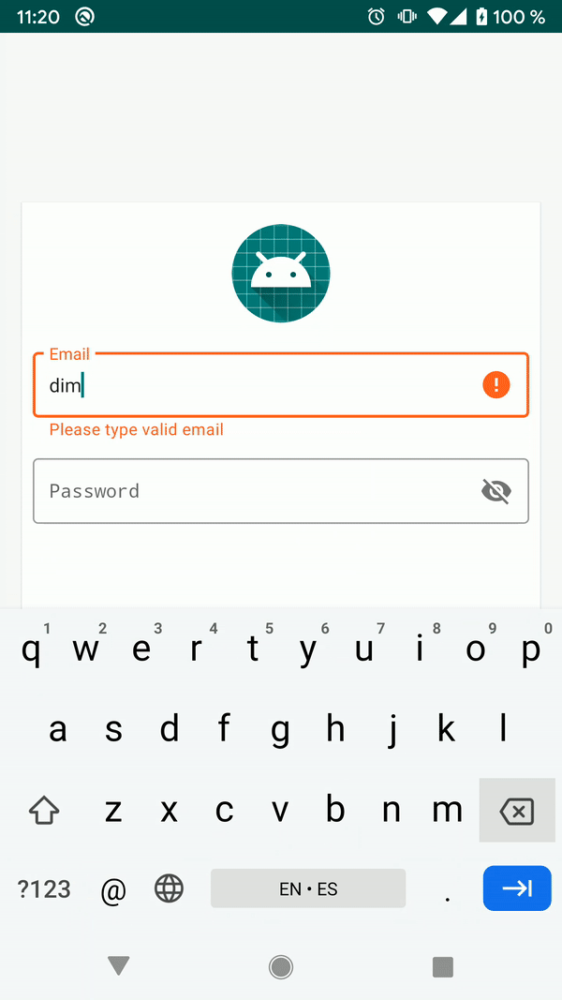
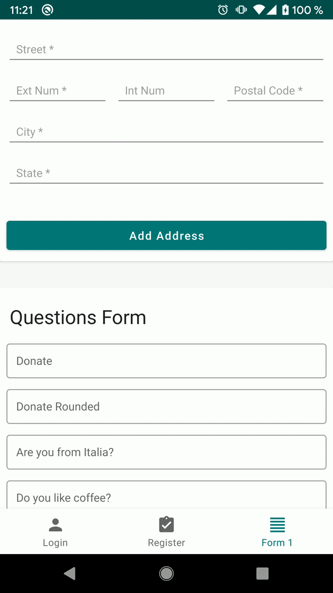
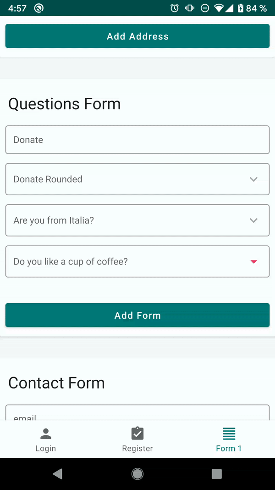
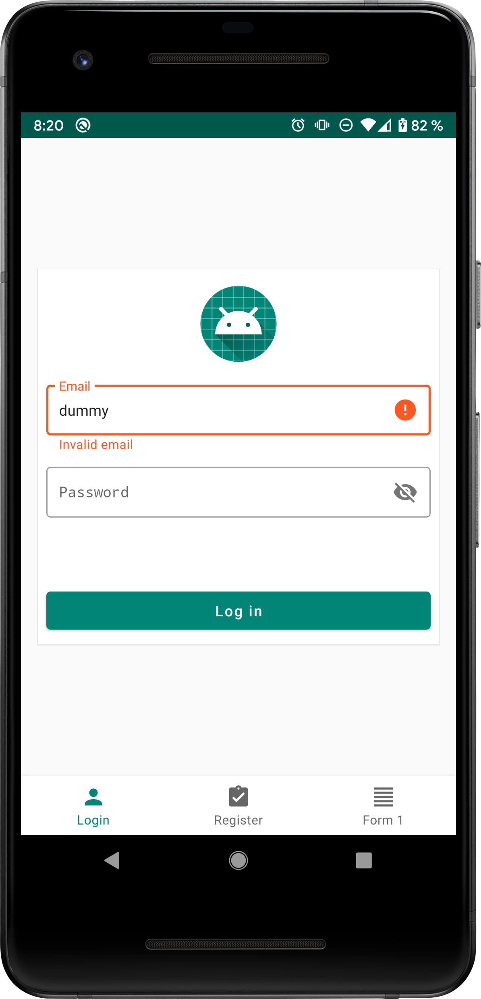

# Auto Validation EditText

[  ](https://bintray.com/ketzalv/android-utils/validationedittext/1.0.8/link) [](https://maven-badges.herokuapp.com/maven-central/io.github.ketzalv/validationedittext)

  


## Overview
Provides a custom component of Edittext, that facility create forms, and its validations, as require a little lines of code for use

## Changelog

Version 1.0.8
* Fix bug about of render

Version 1.0.6
* Fix bug related with typeface in input password
* Fix bugs in sample
* Update gradle version

Version 1.0.5
* Fix several bug§

Version 1.0.3
* Can show a dialog with multiple options to choice like a drop down
* Can modify the drawableEnd that shows when is enable OptionsMode
* updated interface of callbacks when is enable autovalidate in realtime
* SampleApp updated with more examples

Version 1.0.2
* Validate in realtime the current regular expression
* Automatic configuration of field need, for example the correct keyboard
* Provides methods to validate in code
* Configurated to work with TextInputLayout or alone
* Can modify like Edittext with styles or attributes
* Provide a little personalization layout in specific fields for example in numberCurrency type the User Experience required the pattern $0,000.00 and show it

## Requirements

* Project migrated or implemented *AndroidX components*

## Install

Gradle dependency:
```Groovy
implementation 'io.github.ketzalv:validationedittext:1.0.8'
```

Maven dependency:
```XML
<dependency>
  <groupId>io.github.ketzalv</groupId>
  <artifactId>validationedittext</artifactId>
  <version>1.0.8</version>
  <type>pom</type>
</dependency>
```
## Proguard
it isn't necesary exclude something 


## Usage

The next section explains how to use this, if you are need to see running this feel free of download the repo and run the sample

##### In XML:

You can use Edittext alone or inside in TextInputLayout

In this example you can see a Edittext of email field, with autovalidate enabled and automatic show errors in realtime

```XML
    <io.github.ketzalv.validationedittext.ValidationEditText
        android:id="@+id/edit_email"
        android:hint="Email"
        android:padding="12sp"
        android:textSize="14sp"
        android:layout_width="match_parent"
        android:layout_height="wrap_content"
        android:imeOptions="actionNext"
        app:autoValidate="true"
        app:showErrorMessage="true"
        app:format="email"/>
```

if you want to validate a specific pattern can do something like this:

```XML
 <com.google.android.material.textfield.TextInputLayout
    style="@style/Widget.MaterialComponents.TextInputLayout.OutlinedBox"
    android:layout_marginEnd="8dp"
    android:layout_marginStart="8dp"
    android:layout_marginTop="8dp"
    app:passwordToggleEnabled="true"
    android:layout_width="match_parent"
    android:layout_height="wrap_content">
    <io.github.ketzalv.validationedittext.ValidationEditText
        android:id="@+id/edit_password"
        style="@style/EditText.Validation"
        android:hint="Password"
        android:layout_width="match_parent"
        android:layout_height="wrap_content"
        android:imeOptions="actionDone"
        app:format="password"
        app:regularExpression="((?=.*\\d)(?=.*[a-z])(?=.*[A-Z]).{6,20})"
        app:errorEmptyMessage="Empty Password"
        app:errorMessage="Please type password with at lease one Cap letter, one number and minim 8 characters"/>
</com.google.android.material.textfield.TextInputLayout>
```
To show a Edittext with options in xml, and replace drawable at the end of view if is needed.

```XML
<com.google.android.material.textfield.TextInputLayout
    style="@style/Widget.MaterialComponents.TextInputLayout.OutlinedBox"
    android:layout_marginTop="8dp"
    android:layout_marginEnd="8dp"
    android:layout_marginStart="8dp"
    android:layout_width="match_parent"
    android:layout_height="wrap_content">
    <io.github.ketzalv.validationedittext.ValidationEditText
        android:id="@+id/edit_question4"
        android:hint="Do you like a cup of coffee?"
        android:layout_width="match_parent"
        android:layout_height="wrap_content"
        android:imeOptions="actionNext"
        app:autoValidate="true"
        app:showErrorMessage="true"
        app:format="text"
        app:drawableOptions="@drawable/ic_arrow_drop_down"
        app:options="@array/play_piano"/>
</com.google.android.material.textfield.TextInputLayout>
```


The next table contains all information about of custom attributes with their description


| name  | type | description |
|---|---|---|
|  app:autoValidate | boolean  | This feature enable and disable the validate in real time |
|  app:showErrorMessage | boolean  | This feature enable and disable auto manage when the field show the error |
|  app:errorEmptyMessage | String  | This feature enable custom error messages in case of the field is empty |
|  app:errorMessage | String  | This feature enable custom error messages in case of the field is not empty |
|  app:regularExpression | String  | This feature match your current regular expression to validate the field |
|  app:minAmount | float  | This feature is only used in NumberCurreny type and NumberCurrencyRounded |
|  app:maxAmount | float  | This feature is only used in NumberCurreny type and NumberCurrencyRounded |
|  app:format | reference  | This feature configure the types that are supported. The types are: **email, password, phone, zipcode, text, number, cellphone, date, personName, numberCurrency, curp, numberCurrencyRounded** |
|  app:options | reference  | This feature enable the edittext to show a dialog with list of options to choice, and enable callback for it |
|  app:drawableOptions | reference  | This feature provides option of replace a default icon of show when the OptionsMode is enabled |


##### In Java:

You can create this view, similar others views with the setters methods provided is the same case like xml

In this case we create a validation edittext and configure for NumberCurrency, and listen the events related with validation
```JAVA
ValidationEditText validationEditText = new ValidationEditText(getActivity(), ValidationType.numberCurrency);
        validationEditText.setAutoValidateEnable(true);
        validationEditText.setShowMessageError(true);
        validationEditText.setHint("Type amount");
        validationEditText.setEmptyMessage("Empty Field");
        validationEditText.setErrorMessage("InvalidField");
        validationEditText.setCustomLocale(Locale.CANADA);
        validationEditText.setOnValidationListener(new ValidationEditText.OnValidationListener() {
            @Override
            public void onValidEditText(ValidationEditText editText, String text) {
                Toast.makeText(getActivity(), "Text valid typed -> " + text, Toast.LENGTH_SHORT).show();
            }

            @Override
            public void onInvalidEditText(ValidationEditText editText) {
                Toast.makeText(getActivity(), "Edittext invalid -> " + editText.getHint(), Toast.LENGTH_SHORT).show();

            }
        });
```

The next case show how to implements OptionsMode
```JAVA
    private void setupOptionsEdittext(LinearLayout view){
        ValidationEditText validationEditText = new ValidationEditText(getActivity(), ValidationType.text);
        validationEditText.setAutoValidateEnable(true);
        validationEditText.setShowMessageError(true);
        validationEditText.setHint("Do you like a coffee?");
        validationEditText.setEmptyMessage("Empty Field");
        validationEditText.setErrorMessage("Invalid Response");
        validationEditText.setPickerOptions(new String[]{"Yes", "No", "Maybe"}, new ValidationEditText.OptionsListener() {
            @Override
            public void onOptionSelected(ValidationEditText editText, String option) {
                Toast.makeText(getActivity(), "Text valid typed -> " + option, Toast.LENGTH_SHORT).show();
            }
        });
        view.addView(validationEditText);
    }
```

#### Sample project

See sample directory. Sample project contains a powerful implementation with this method, please download and see if you have a questions

 

## Fields Supported

The next table contains all information about of fields supported and their descriptions

| type | default configuration | default validate | image example |
|---|---|---|---|
| **email** | InputType <ul><li>TYPE_CLASS_TEXT</li><li>TYPE_TEXT_VARIATION_EMAIL_ADDRESS</li></ul><br> Maxlines: 1 | <ul><li>Regular Expression: android.util.Patterns.**EMAIL_ADDRESS**</li><li>Check empty field</li></ul>|
| **password** | InputType <ul><li>TYPE_CLASS_TEXT</li><li>TYPE_TEXT_VARIATION_PASSWORD</li></ul><br> Maxlines: 1 | <ul><li>Check empty field</li></ul> |
| **phone** | InputType <ul><li>TYPE_CLASS_PHONE</li></ul><br> Maxlines: 1 | <ul><li>Regular Expression: ` Pattern.compile("^[0-9]{8}|[0-9]{10}$") ` </li><li>Check empty field</li></ul> |
| **zipcode** | InputType <ul><li>TYPE_CLASS_NUMBER</li></ul><br> Maxlines: 1 <br> MaxLength: 5 | <ul><li>Check empty field</li></ul> |
| **text** | InputType <ul><li>TYPE_CLASS_TEXT</li></ul><br> Maxlines: 1 | <ul><li>Check empty field</li></ul> |
| **number** | InputType <ul><li>TYPE_CLASS_NUMBER</li></ul><br> Maxlines: 1 | <ul><li>Check empty field</li></ul> |
| **cellphone** | InputType <ul><li>TYPE_CLASS_PHONE</li></ul><br> Maxlines: 1 <br> MaxLength: 10 | <ul><li>Regular Expression: ` Pattern.compile("^[0-9]{8}|[0-9]{10}$") ` </li><li>Check empty field</li></ul> |
| **date** | InputType <ul><li>TYPE_CLASS_DATETIME</li><li>TYPE_DATETIME_VARIATION_DATE</li></ul><br> Maxlines: 1 | <ul><li>Check empty field</li></ul> |
| **personName** | InputType <ul><li>TYPE_TEXT_FLAG_CAP_SENTENCES</li><li>TYPE_CLASS_TEXT</li></ul><br> Maxlines: 1 | <ul>li>Check empty field</li></ul> |
| **numberCurrency** | InputType <ul><li>TYPE_CLASS_NUMBER</li></ul><br> Maxlines: 1 | <ul><li>Check if is Valid mount</li><li>Check empty field</li></ul> |
| **curp** | InputType <ul><li>TYPE_CLASS_TEXT</li></ul><br> Maxlines: 1 <br> Maxlength: 18 <br> TextAllCaps: true| <ul><li>Check if length is 18</li><li>Check empty field</li></ul> |
| **numberCurrencyRounded** | InputType <ul><li>TYPE_CLASS_NUMBER</li></ul><br> Maxlines: 1 | <ul><li>Check if is Valid mount</li><li>Check empty field</li></ul> |